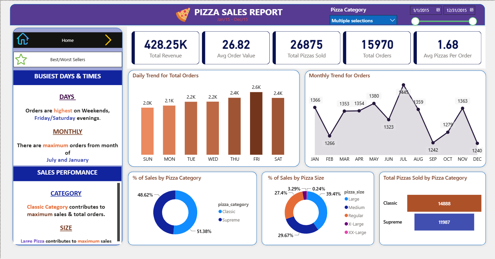

# 🍕 Restaurant Sales Intelligence & Performance Analytics System

## 📌 Project Overview

Businesses generate thousands of transactions daily, but raw sales data alone does not provide actionable insights. This project transforms restaurant sales data into a comprehensive Business Intelligence solution that enables stakeholders to understand revenue drivers, customer purchasing behavior, product performance, and sales trends.

Using **SQL Server** for data analysis and **Power BI** for visualization, I developed an interactive analytics dashboard that converts over **21,350 customer orders** and **49,500+ pizzas sold** into meaningful business insights supporting strategic decision-making.

---

## 📷 Dashboard Preview

### Executive Overview Dashboard



### Best & Worst Sellers Analysis Dashboard


*Replace the image above with your Best & Worst Sellers Dashboard screenshot.*

---

## 🎯 Business Problem

Restaurant management needed a data-driven approach to answer critical business questions:

- Which products generate the highest revenue?
- What are the busiest days and times?
- Which pizza categories contribute most to sales?
- What customer purchasing patterns exist?
- Which products are underperforming?
- How can sales performance be monitored efficiently?

Without analytical reporting, identifying these trends manually would be time-consuming and prone to errors.

---

## 📊 Project Objectives

The objectives of this project were to:

- Analyze overall sales performance
- Identify revenue-driving products
- Understand customer ordering behavior
- Discover peak sales periods
- Evaluate category and size performance
- Develop executive-level dashboards for decision-making

---

## 🛠️ Tools & Technologies

| Tool | Purpose |
|--------|----------|
| SQL Server | Data Extraction & Analysis |
| Power BI | Dashboard Development |
| DAX | KPI Calculations |
| Power Query | Data Transformation |
| Excel | Data Preparation |

---

## 📈 Key Performance Indicators (KPIs)

### Revenue & Order Metrics

- **Total Revenue:** $817K+
- **Total Orders:** 21,350+
- **Total Pizzas Sold:** 49,500+
- **Average Order Value**
- **Average Pizzas Per Order**

### Product Performance Metrics

- Best Selling Pizzas
- Worst Selling Pizzas
- Category Contribution
- Size Contribution

### Trend Analysis

- Daily Order Trends
- Monthly Order Trends
- Peak Sales Periods

---

## 🔍 Analytical Approach

### 1. Data Preparation

- Cleaned and validated transactional sales records
- Standardized product categories and attributes
- Prepared data for reporting and visualization

### 2. SQL Analysis

Developed analytical SQL queries to:

- Calculate revenue metrics
- Measure product performance
- Analyze order trends
- Evaluate category performance
- Identify top and bottom performers

### 3. Dashboard Development

Designed interactive Power BI dashboards featuring:

- KPI Scorecards
- Trend Visualizations
- Dynamic Filters & Slicers
- Product Rankings
- Executive Summary Insights

---

## 📌 Key Insights

### Customer Purchasing Behavior

- Weekend evenings generated the highest order volumes.
- Friday and Saturday consistently recorded peak demand.

### Revenue Drivers

- The Classic Pizza category contributed the largest share of total revenue.
- Large-sized pizzas generated the highest percentage of sales.

### Product Performance

- A small group of products contributed a significant portion of total revenue.
- Several products consistently underperformed, highlighting opportunities for menu optimization.

### Sales Trends

- Monthly demand fluctuations revealed seasonal purchasing patterns.
- Peak sales periods identified opportunities for staffing and inventory optimization.

---

## 📊 Results

| Metric | Value |
|----------|----------|
| Total Revenue | $817K+ |
| Customer Orders | 21,350+ |
| Pizzas Sold | 49,500+ |
| Dashboard Pages | 2 |
| KPIs Tracked | 5+ |

### Business Impact

- Automated sales reporting and analysis.
- Improved visibility into revenue-driving products.
- Enabled data-driven business decision-making.
- Reduced manual effort required for sales performance monitoring.

---

## 📂 Project Structure

```text
Restaurant-Sales-Analytics/
│
├── Dataset/
│   └── pizza_sales.csv
│
├── SQL/
│   └── Pizza_Sales_Queries.sql
│
├── PowerBI/
│   └── Pizza_Sales_Dashboard.pbix
│
├── Images/
│   ├── executive_dashboard.png
│   └── best_worst_dashboard.png
│
└── README.md
```

---

## 🚀 Skills Demonstrated

### Data Analytics

- Exploratory Data Analysis (EDA)
- KPI Development
- Business Intelligence Reporting
- Trend Analysis

### SQL

- Aggregations
- Grouping & Filtering
- Business Query Development
- Performance Analysis

### Power BI

- Dashboard Design
- DAX Measures
- Interactive Reporting
- Data Storytelling

### Business Understanding

- Revenue Analysis
- Product Performance Evaluation
- Customer Behavior Analysis
- Decision Support Analytics

---

## 💡 Business Value

This project demonstrates how organizations can leverage data analytics and business intelligence to transform raw transactional data into actionable insights. By combining SQL analytics with interactive Power BI visualizations, stakeholders can quickly identify opportunities, monitor performance, and make informed business decisions backed by data.

---

## 🖼️ Additional Screenshots

### KPI Requirements


*Insert your KPI Requirements screenshot here.*

### Dashboard Design Requirements


*Insert your Dashboard Requirements screenshot here.*

---

## 👨‍💻 Author

**Brightman Mutumwapavi**

Data Science Graduate | Data Analyst | Business Intelligence Enthusiast

### Connect With Me

- GitHub: https://github.com/BrightmanMT
- LinkedIn: *Add Your LinkedIn URL Here*

---

### ⭐ If you found this project useful, consider giving it a star!
